#### 👌 <i>Muhammad Syaiful Rahman</i> 👌 

## Figma Design
- Link : https://www.figma.com/design/LXos2tL990XhB3avltNII7/Travel-Day---Iful-Rahman?node-id=125-301&node-type=canvas&t=s2gtPJTpE54uVFoC-0

## Live Preview
- Link Visit online: [Travel Day - Iful Rahman](https://final-project-travel-day.vercel.app/)

## Technology
- HTML, CSS, JavaScript
- React.js + Vite
- Tailwind CSS
- Redux

## Feature
<b>Role Admin</b>
<br>Login Account :
<br>Username : miftahfarhan@gmail.com
<br>Pass : qwerty123
- Can access Dashboard Menu for Create, Read, Update, Delete (CRUD) any konten such as banner, categories, promos, activities

<b>Role User</b>
<br>Login Account :
<br>Username : 1234@gmail.com
<br>Pass : qwerty123
- Can access add to cart menu

## Library
- Axios
- React/ React-DOM
- React Slick
- React Toastify
- React Icons
- Slick Carousel

## Installation

To run this project locally, follow these steps:

1. Download this project from this repository:

   ```bash
   Download Zip Folder

   ```

2. Install the dependencies:

   ```bash
   npm install

   ```

3. Start the development server:

   ```bash
   npm start

   ```

4. Open your browser and navigate to http://localhost:3000

## Screenshots (Preview)

<p align="center">
  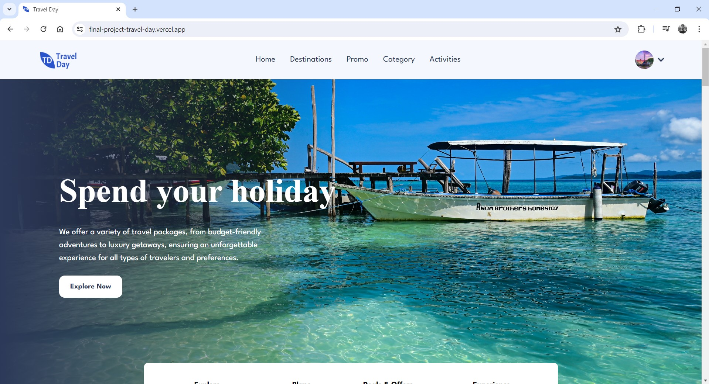
</p>

<p align="center">
  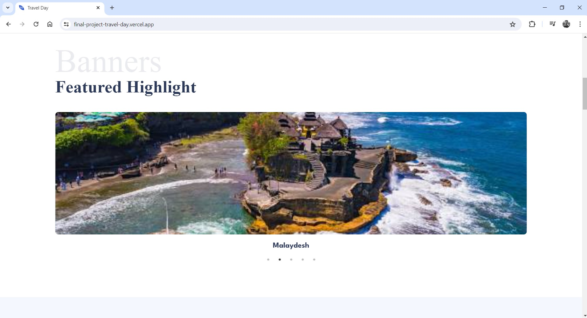
</p>

<p align="center">
  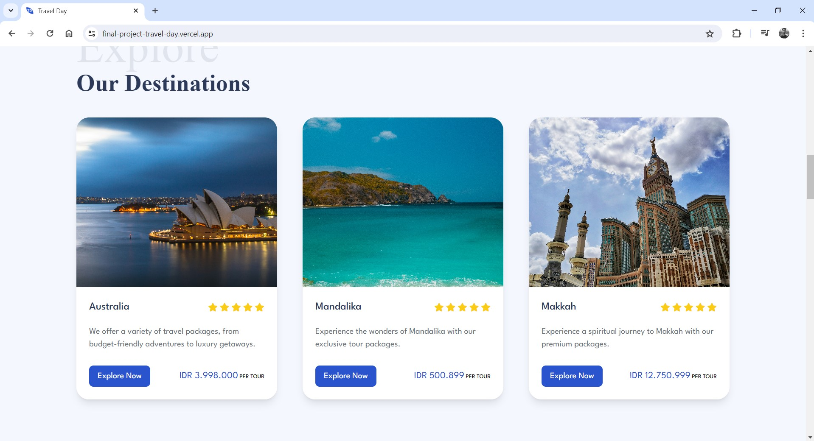
</p>

<p align="center">
  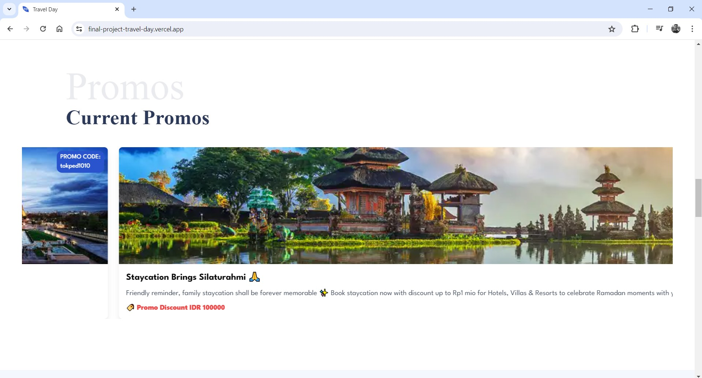
</p>

<p align="center">
  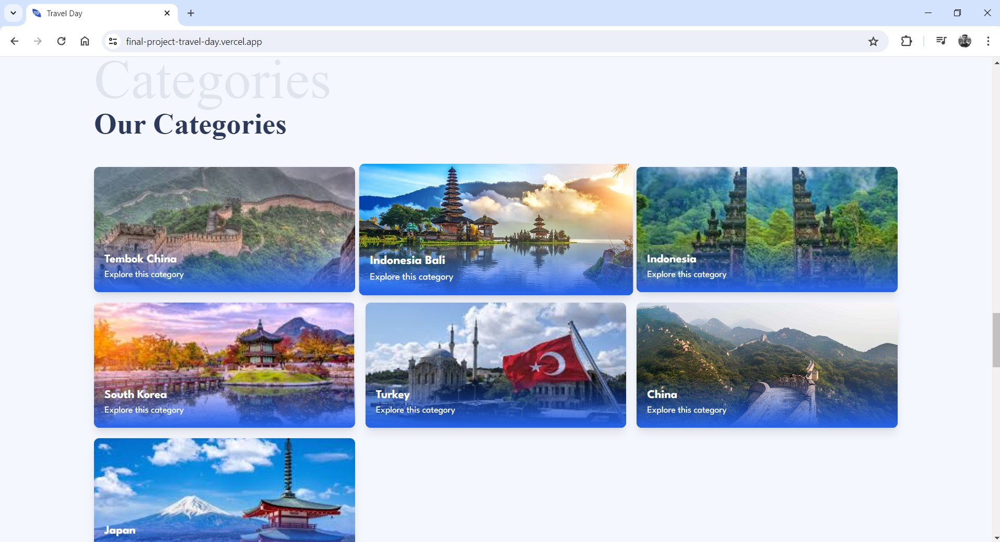
</p>

<p align="center">
  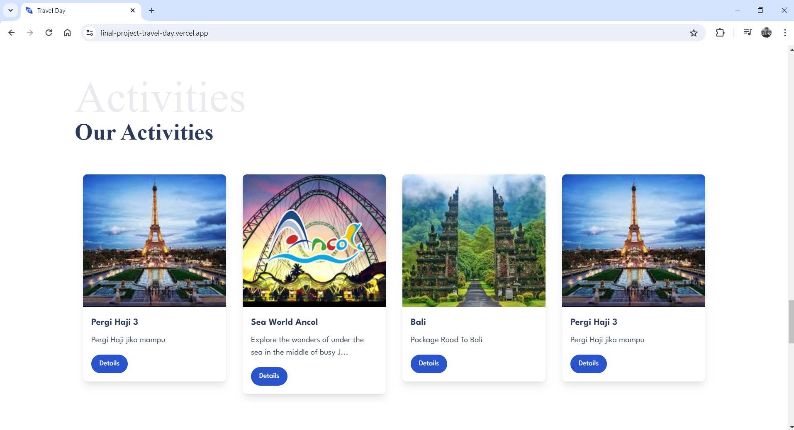
</p>

<p align="center">
  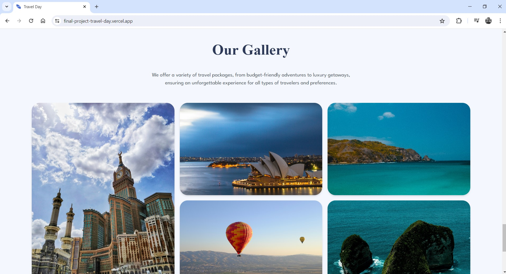
</p>

<p align="center">
  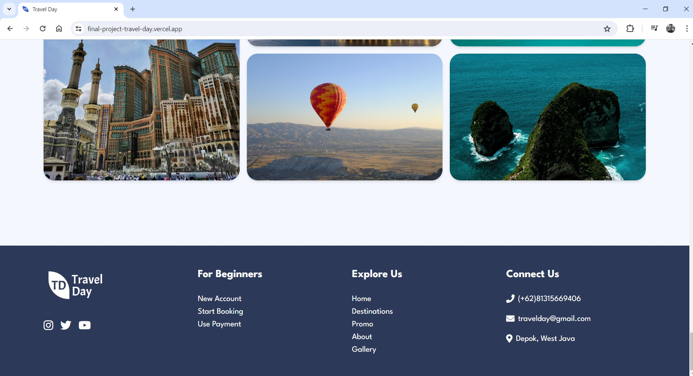
</p>

<p align="center">
  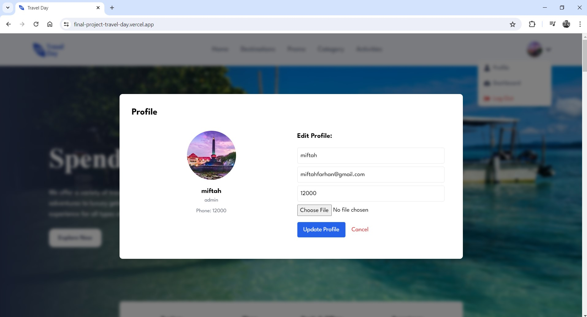
</p>

<p align="center">
  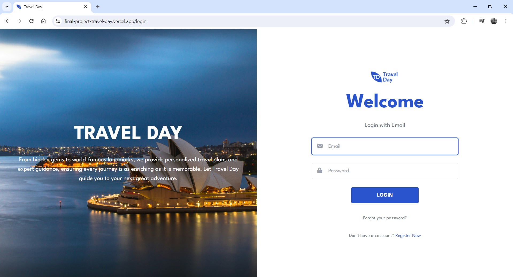
</p>

<p align="center">
  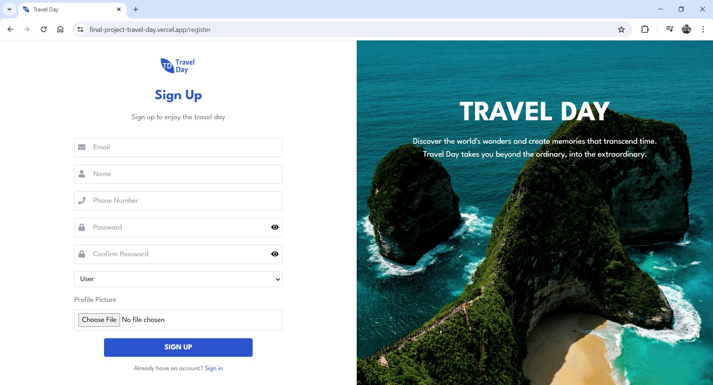
</p>

<p align="center">
  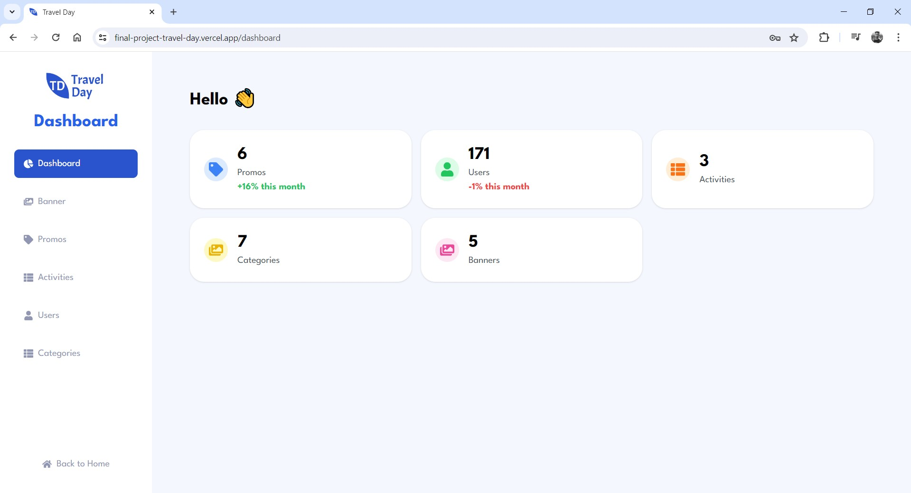
</p>

<p align="center">
  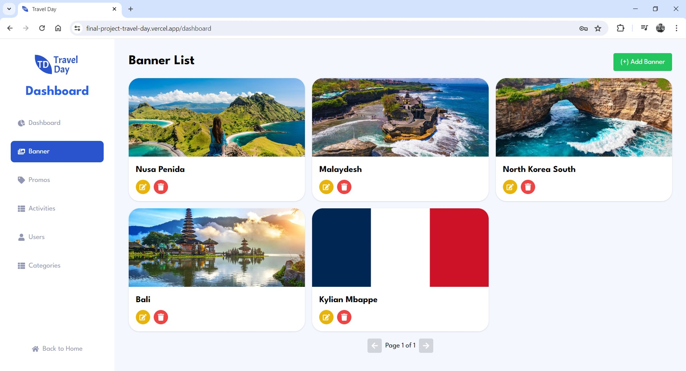
</p>

<p align="center">
  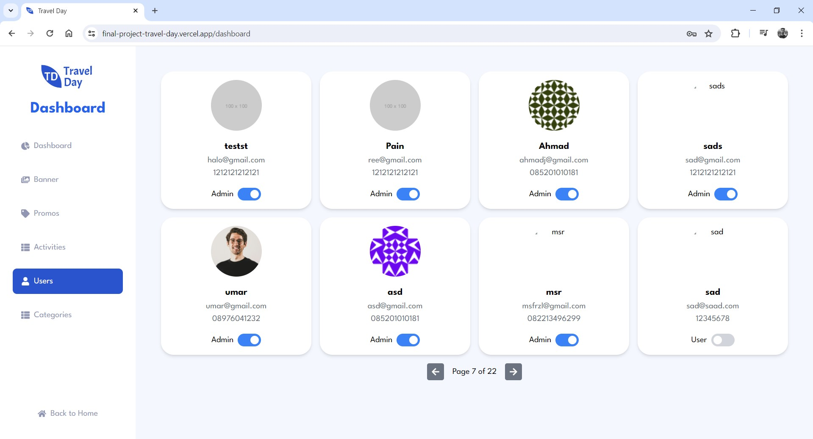
</p>

# React + Vite

This template provides a minimal setup to get React working in Vite with HMR and some ESLint rules.

Currently, two official plugins are available:

- [@vitejs/plugin-react](https://github.com/vitejs/vite-plugin-react/blob/main/packages/plugin-react/README.md) uses [Babel](https://babeljs.io/) for Fast Refresh
- [@vitejs/plugin-react-swc](https://github.com/vitejs/vite-plugin-react-swc) uses [SWC](https://swc.rs/) for Fast Refresh
